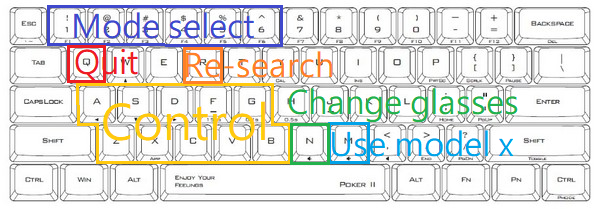

# Vglass
A way that you can put on Virtual Glasses everywhere


# A、Environment dependence

* python 3.6
* dlib
* opencv
* numpy

# B、Function



|keyboard|mode|keyboard|update parameter|
|---|---|---|---|
|`1`|axis|`z`|top increase|
|`2`|head box|`a`|top decrease|
|`3`|glasses marker|`x`|buttom increase|
|`4`|landmark|`s`|buttom decrease
|`5`|glasses model|`c`|left、right increase|
|`6`|cv bad|`d`|left、right decrease|
|`q`|quit|`v`|temple offset increase|
|`n`|change glasses|`f`|temple offset decrease|
|`r`|re-search model|`b`|depth increase|
|`m`|use model 20|`g`|depth decrease|

# C、Run it

* 1. `cd` to the Vglass located
* 2. Run `main.py`

```bash=
optional arguments:
  -h, --help            show this help message and exit
  -p PATH, --path PATH  Multimedia file location.
  -m MODE, --mode MODE  File type. Must be "video" or "image".
  -s                    -s to active the save mode
  --save SAVE           The path to save the output.
```

### example

* Run with default camera `0`
  * `$python main.py -p 0`
* Run with `video` input
  * `$python main.py -p <video path>`
* Run with `image` input
  * `$python main.py -p <picture path> -m image`

Note that : path can be an `url` or `file`
